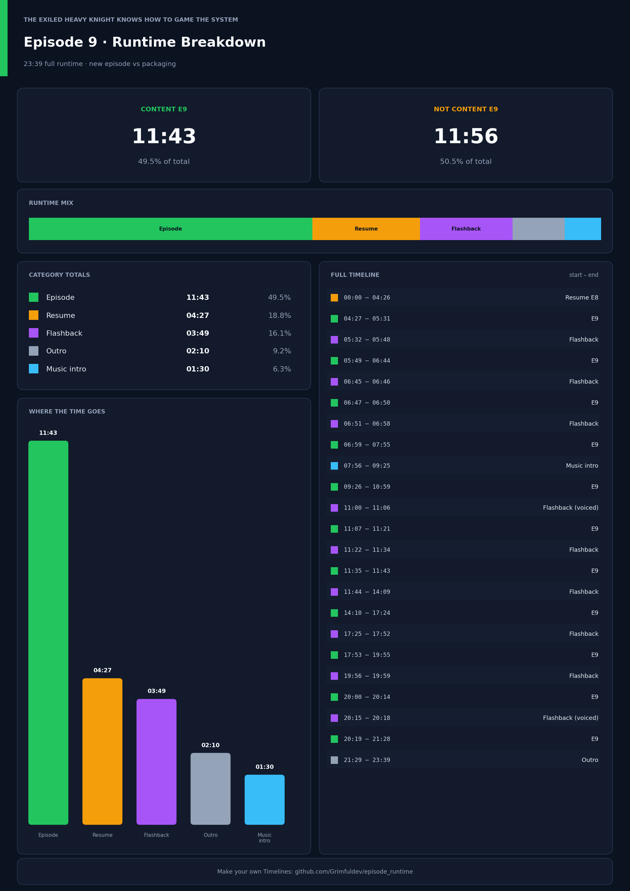

# Episode Runtime

I made this because I got annoyed timing how much of an anime episode was actually new vs recap / OP / ED / flashbacks.
That’s it.

## Run it

Easiest way: download the exe from [Releases](https://github.com/Grimfuldev/episode_runtime/releases) and double-click it.

If you’d rather run the Python file yourself, on the cloned folder of this github project:

`pip install -r requirements.txt`
And then:
`python episode_runtime.py`

## On this project

The example below corresponds to the resulting PNG from running example.json, which is, as you notice, an example of what you can do with this program.

